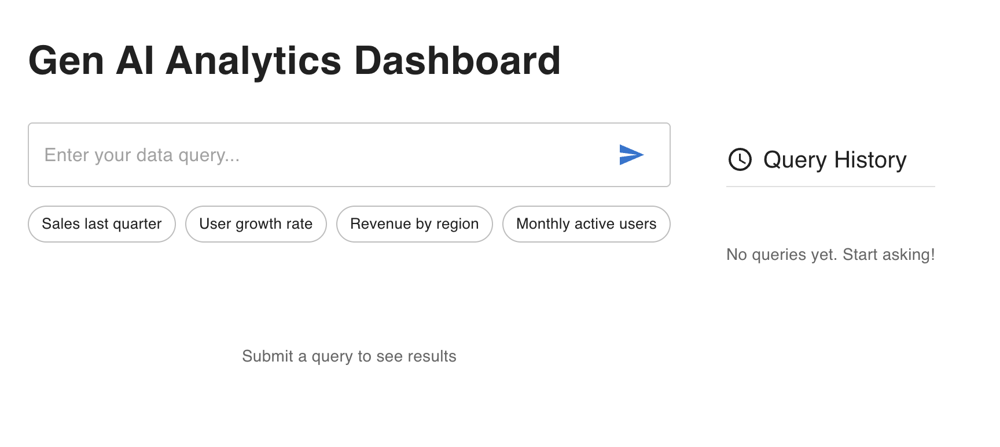

# Gen AI Analytics Dashboard Prototype

A React-based dashboard prototype demonstrating natural language query interaction and data visualization using mock AI processing.



## Features

-  Natural language query input
-  Mock AI processing simulation
-  Query history tracking
-  Data visualization using Recharts
-  Loading state animations
-  Error state handling
-  Responsive design

## Installation

1. **Clone the repository**
```bash
git clone https://github.com/yourusername/gen-ai-dashboard.git
cd gen-ai-dashboard
```

2. **Install dependencies**
```bash
npm install
```
3. **Start Development Server**
```bash
npm start
```
The app will run on http://localhost:3000

## Project Structure
```
src/
├── app/
│   └── store.js          # Redux store configuration
├── features/
│   └── query/
│       └── querySlice.js # Query state management
├── components/
│   ├── QueryInput.jsx    # Search input component
│   ├── QueryHistory.jsx  # Query history panel
│   └── ResultsDisplay.jsx# Chart visualization
├── App.js                # Main application layout
└── index.js              # Entry point
```
## Technology Stack

- **React** - UI component library
- **Redux Toolkit** - State management
- **Material-UI** - UI components and styling
- **Recharts** - Data visualization
- **React Redux** - React/Redux integration
- **React Icons** - Icon library

## State Management

The Redux store manages the following state:

- Query history
- Current results
- Loading states
- Error messages
- AI suggestions

### Key Redux Concepts

- **Slice**: `querySlice.js` handles all query-related logic.
- **Async Thunk**: `processQuery` simulates AI processing.
- **Selectors**: Access state values from components.

## Simulated AI Processing

The mock AI system:

- Generates random data points.
- Returns a consistent data structure.
- Simulates a 1.5s API delay.
- Has a 10% random error rate.
